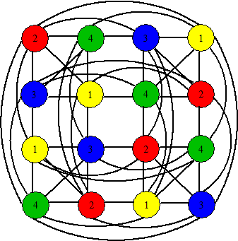

# Graph Coloring

Eduardo Savian, Marcos Fehlauer, Pablo Marques

## Description

Fazer a distribuição dos valores no tabuleiro do Sudoku, respeitando suas restrições, para tabuleiros de ordem variável.

A ordem do tabuleiro e o ponto de inicio da distribuição devem ser informados pelo usuário. (Pode restringir a tabuleiros de ordem NxN e com N possuindo raiz quadrada exata, e com N máximo igual a 16).

- Deve ser desenhado o grafo correspondente com os vertices coloridos.

- A posição inicial deve ser escolhida pelo usuário (onde iniciará a distribuição dos valores/cores)

- O trabalho deverá ser apresentado para a turma, explicando em detalhes como o algoritmo de solução foi feito.

- Exemplo:

    []

## Para executar para fazer o seguinte comando

```bash
./sudoku-coloring.exe
```
